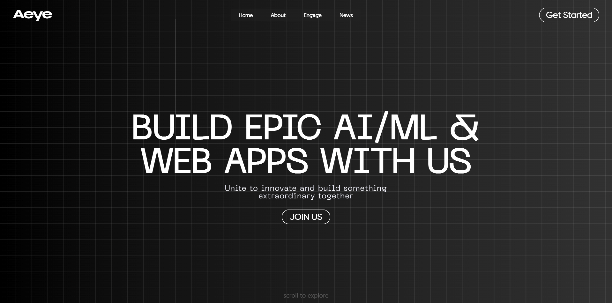

# Aeye - Innovative AI/ML & Web Development Community

## About Aeye

Aeye is a vibrant community that brings together web developers and AI/ML experts to collaborate on transformative projects. Our platform focuses on exploring new technologies, sharing ideas, and building innovative solutions that make a real impact.

This project was created for the *New Type Works Hacks 2.0* hackathon, aiming to showcase the value of joining our community and provide details on how to get involved.

## Features

- Engaging landing page with dynamic background animation
- Detailed "About" section highlighting community benefits
- Interactive "Engage" page showcasing various ways to contribute
- Newsletter subscription for staying updated with latest innovations
- Responsive design for seamless viewing across devices

## Technologies Used

- HTML5
- CSS3
- Tailwind CSS
- JavaScript (ES6+)
- GSAP

## Project Structure

- `index.html`: Main HTML file
- `style.css`: Custom CSS styles
- `font.css`: Font declarations
- `script.js`: JavaScript for animations and interactivity
- `assets/`: Directory containing images and fonts
- `docs/`: Directory containing screenshots of the project

## Contact

Twitter - [@adytyaX](https://x.com/adytyaX)
LinkedIn - [Aditya](https://www.linkedin.com/in/adityasingh44/)